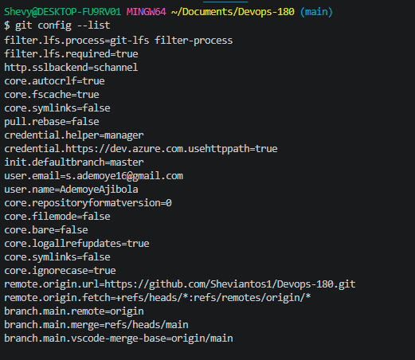
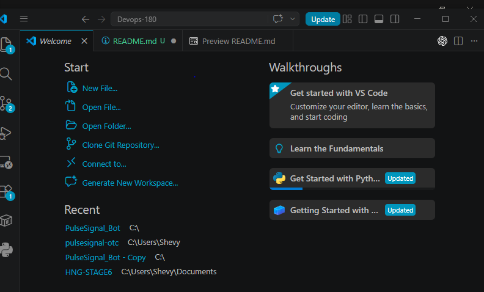

# DevOps Bootcamp Projects

This repository documents my journey through the 200 day DevOps bootcamp, starting with Week 0: Developer Environment Setup. Each week's work will be added here as a separate folder or file as the bootcamp progresses.

### About This Project

This is a personal learning repository used to track my progress as I build the skills, tools, and workflows needed for a career in DevOps. It starts with setting up a proper developer environment on my machine and will grow to include hands-on projects covering topics like Linux, Git, CI/CD, containers, cloud infrastructure, and automation.

### Week 0 — Developer Environment Setup

Set up a fully working developer environment from scratch, including WSL2 (for Windows users), Git, GitHub, and VS Code, then use that setup to create and push my first repository.

#### What I Did
1. Installed WSL2 (Windows only) to run a Linux (Ubuntu) environment inside Windows.
* I Ran wsl --install in PowerShell (as Administrator)
* Then I restarted the machine and completed Ubuntu setup with a username/password
2. I then created a GitHub account using a professional username, since this profile is public-facing and may be seen by recruiters.
3. Installed and configured Git by running 

   `sudo apt update && sudo apt install git -y`
   `git config --global user.name "AdemoyeAjibola"`
   `git config --global user.email "s.ademoye16@gmail.com"`
   `git config --list   # verify settings saved`

4. I installed VS Code and added the following extensions:
Remote - WSL
Docker
YAML
GitLens
Python

5. I created this GitHub repository (Devops-180), initialized with a README, and cloned it locally:
bash
   git clone https://github.com/Sheviantos1/Devops-180.git
   cd Devops-180

6. I then documented my setup in week0-setup.md, covering:
- The OS/machine I'm using
- Everything I installed
- One thing I'm excited to learn during the bootcamp
Then committed and pushed it:

   git add .
   git commit -m "Week 0: setup complete"
   git push