# DevOps Fundamentals - Linux Commands

Linux is the backbone of most DevOps environments. Understanding basic Linux commands is essential for managing servers, automation, and deployments.

Below are 30 important Linux commands every DevOps engineer should know, along with explanations and practical examples.

1. `pwd`(Print Working Directory): Prints the full path of the current working directory.

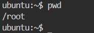

2. `ls` (List): Lists the contents of a directory. It shows files and folders in the current or specified directory. Options like -l (long format) and -a (all, including hidden files) are extremely common in DevOps workflows for auditing directory contents.

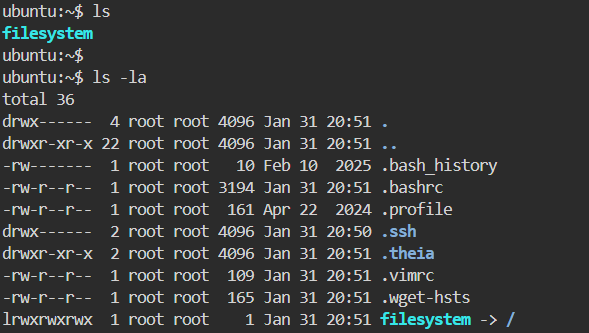

3. `cd` (Change Directory): Changes the current working directory

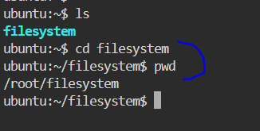

4. `mkdir` (Make Directory): Creates one or more new directories. The -p flag allows creating nested directories in one command, even if the parent directories don't yet exist. 

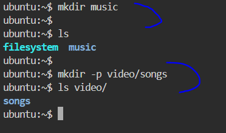

5. `rm` (Remove): Removes files or directories. The -r flag enables recursive deletion (for directories), and -f forces deletion without prompting.

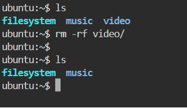

6. `touch`: Creates an empty file or updates the timestamp of an existing file.

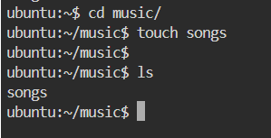

7. `cp` (Copy): Copies files or directories from one location to another. The -r flag is required to copy directories recursively.

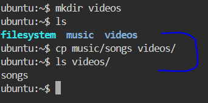

8. `mv` (Move): Moves or renames files and directories. Unlike cp, the original is removed after the operation. 

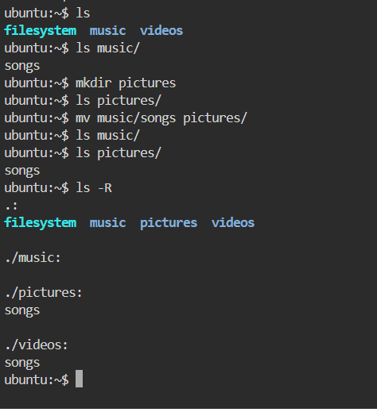

9.`rmdir` (Remove Directory): Deletes an empty directory.

10. `find`: Searches for files and directories within a directory tree based on conditions like name, type, size, permissions, or modification time. It's extremely powerful in DevOps for locating config files, finding large files consuming disk space, or identifying files that need permission changes.

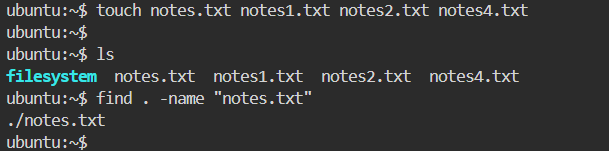

`.` in the above example means search in the current directory while `-name` means search by file name

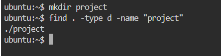

Where `-type d` = search for directories only, `-name "project"` = look for folder named project

11. `cat`: Concatenates and displays the contents of files. It can display one or multiple files, combine files together, or be used to quickly read short configuration files.

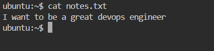

12.  `less`: Allows page-by-page viewing of large files.  

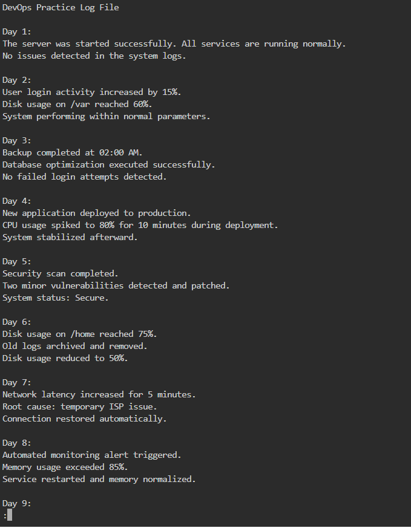

13. `tail`: Outputs the last part of a file.

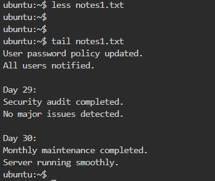

14. `head`: Outputs the first part of a file. 

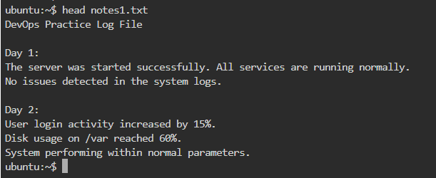

15. `echo`: Prints text to the terminal or writes to a file.

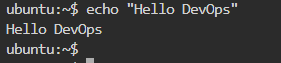

In the below example, `echo` creates status.txt (if it doesn’t exist) then Writes the text inside it

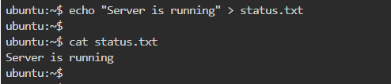

`echo` is also used to append text in a file as shown in the example below.

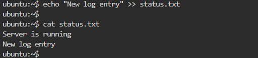

`>` overwrites the file while `>>` adds to the end of the file

16. `grep`: Searches text using patterns (extremely useful in logs).

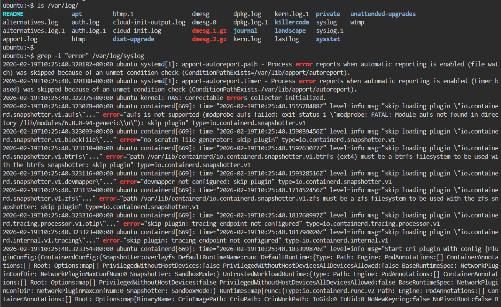

17.  `chmod` (Change File Permissions): is used to change the permissions (also called "mode") of files and directories in.
Permissions decide who can:
- read (r): view the file contents
- write (w): modify or delete the file
- execute (x): run the file as a program/script (or enter a directory)

There are three permission groups:
- User (u) – the file owner
- Group (g) – users in the file's assigned group
- Others (o) – everyone else

Numeric (Octal) Permission System
Permissions are often set using numbers (0–7), where each value is a sum:
- 4 = read (r)
- 2 = write (w)
- 1 = execute (x)

Combinations:
- 7 = rwx (4+2+1) → read + write + execute
- 6 = rw- (4+2) → read + write
- 5 = r-x (4+1) → read + execute
- 4 = r-- → read only
- 0 = --- → no permissions

A three-digit number sets permissions for user → group → others.  
Example: 755 = 7 (user) + 5 (group) + 5 (others)

This translates to:  rwxr-xr-x
- Owner (user): full access (read, write, execute)  
- Group: read + execute  
- Others: read + execute  

This is one of the most common settings for scripts, binaries, and web directories — the owner can change the file, but others can run/read it without being able to modify it.

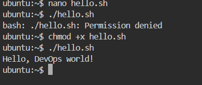
 
The permission denied in the above example happen because the file does not have execute permission.

18. `chown` (Change Ownership): The chown command is used to change the ownership of a file or directory. In Linux, every file has an owner (user) and a group. The `chown` command allows you to change either the user, the group, or both. The -R flag applies the change recursively to all contents of a directory.

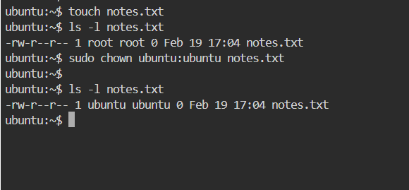

19.  `sudo` (Superuser Do): Allows a permitted user to execute a command as the superuser (root) or another user. It stands for "Superuser Do." In DevOps, it's used to perform privileged operations — installing packages, managing services, editing protected config files — without logging in as root directly.

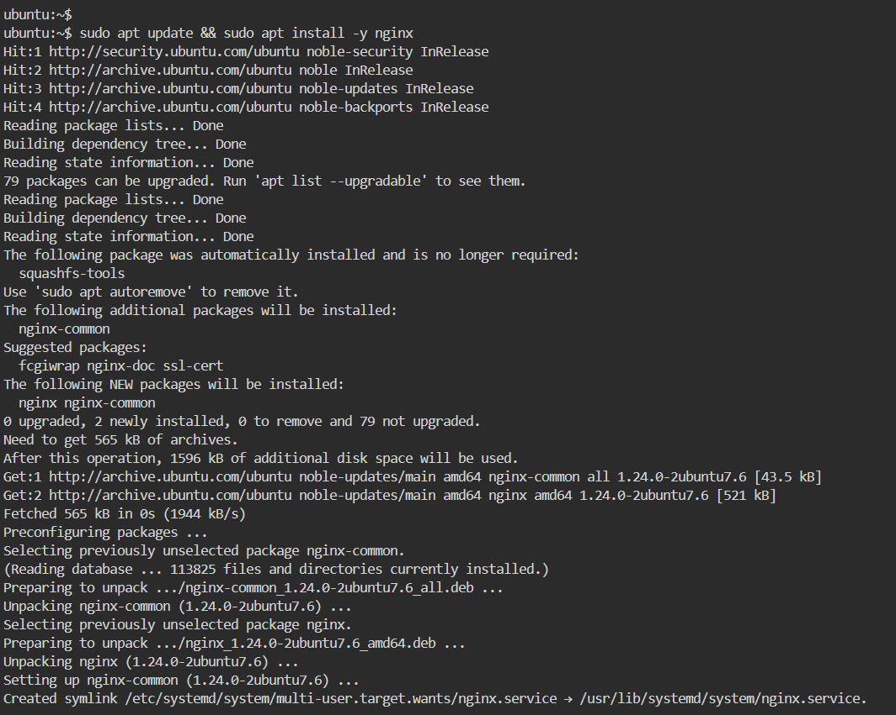

20. wc (Word Count): This is used to count the number of lines, words, characters, or bytes in a file. When used without options, it displays the number of lines, words, and bytes in the specified file.

21. `df`(disk filesystem): It shows how much disk space is used and available on your system.It is mainly used to check if a server is running out of disk space.

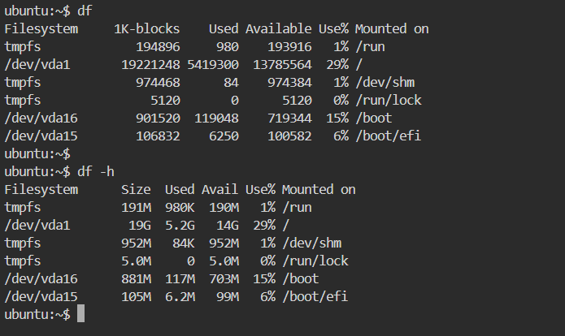

-h = human readable format (shows sizes in KB, MB, GB instead of bytes)

22.  `du` (disk usage): It shows how much space a specific file or directory is using. While `df` shows overall disk space, du shows usage of particular folders.

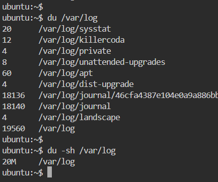

23. `free`: This shows memory (RAM) usage on the system. It tells you: total memory, ssed memory, free memory, swap memory

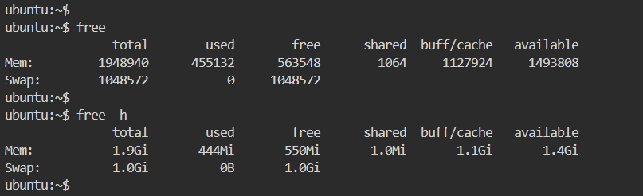

24. `wget`: This is used to download files from the internet using HTTP, HTTPS, or FTP. It works in the background and is commonly used on servers.

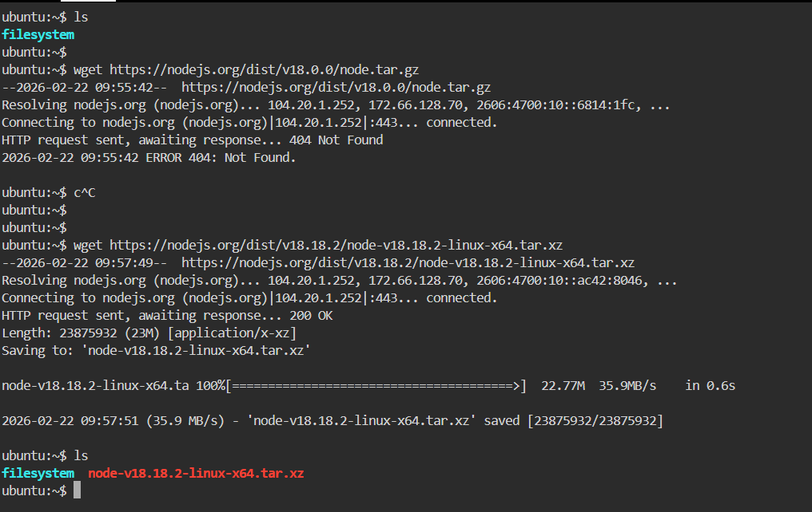

25.  `curl`: It is used to transfer data from or to a server. Unlike wget, it is often used to test APIs and interact with web services, although it can also be used to download file like wget.

- Used to download a simple file like wget

- It can also be used to download a file and rename the filename

- It can be used to test a real public api. This is really important to us as Devops engineers

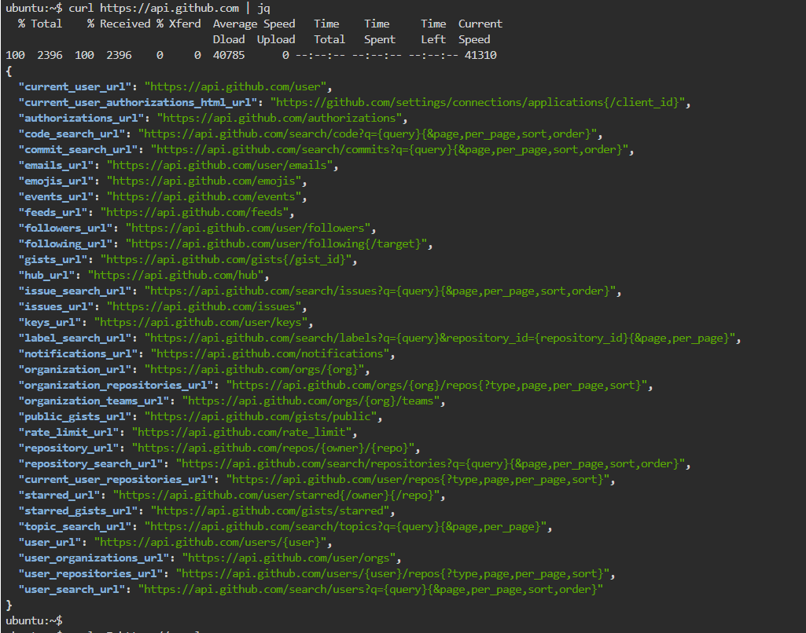

- It can also be used to see only HTTP headers. It is also very useful

- It can be used to enable verbose mode, which shows all the behind‑the‑scenes details of the request and response. This includes DNS lookup, TLS handshake, headers, and connection steps.Useful for troubleshooting network or connection issues.

- It can also be used to simulate a POST request useful for testing api 

26.  `ping`: It is used to test network connectivity between systems. It sends packets to a specified host and measures the response time. For example, ping google.com checks whether the system can reach Google’s servers. The -c option limits the number of packets sent. We mostly use ping to troubleshoot network issues and verify server availability.

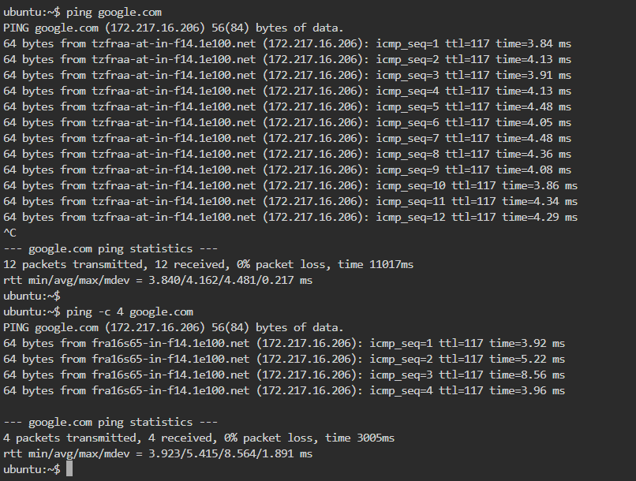

27. `apt`: It is a  package manager used in Debian/Ubuntu-based systems.
It installs, updates, and removes software.

28. `kill`: This sends signals to processes. Despite its name, it doesn't just "kill" processes, it can send various signals to control process behavior. Each signal tells the process what to do. Most common signal are SIGTERM (15) used for Graceful shutdown and SIGKILL (9) used for Force kill.

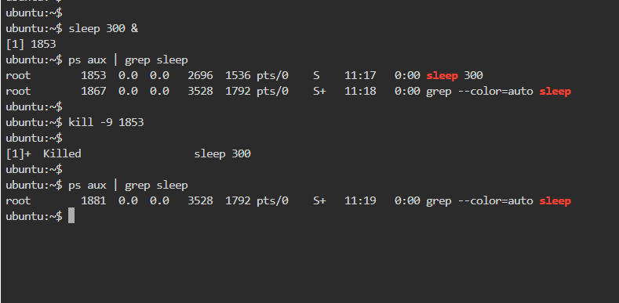

29. `ps` (process status):It displays information about active processes. It provides a snapshot of current processes with their PIDs, resource usage, status, and more.

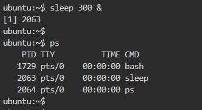

30. `tar` (Tape ARchive):It creates and manipulates archive files. It bundles multiple files/directories into a single file, optionally with compression. It's essential for backups, deployments, and file distribution.

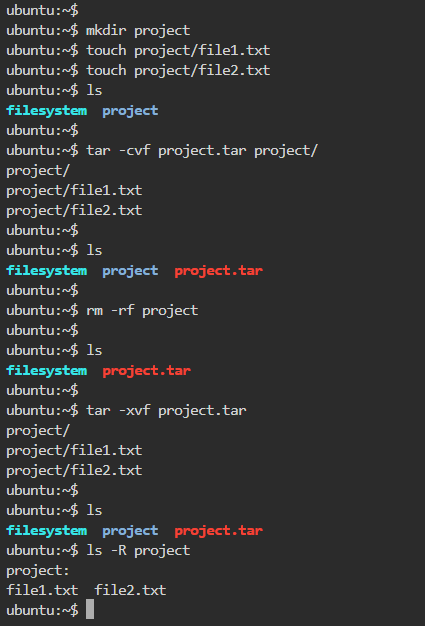

This concludes Week 1: 30 essential Linux commands for DevOps workflows, complete with explanations and practical examples.  

## THANK YOU

